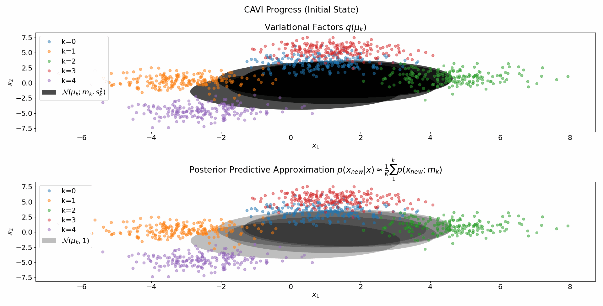

# CAVI for 2D GMM
This repository revolves around the coordinate-ascent-variational inference algorithm, described in the paper "Variational Inference: A Review for Statisticians" By Blei et al [[1]](#1).
The implementation, as well as a summarizing report, were conducted as part of the final project in the Signal-Processing-For-Data-Science course (05107-26001) in Tel-Aviv University.

# User Instructions:
* Clone the repository to your local host using "git clone https://github.com/bermanz/Sp2DsFinalProject.git"
* Get the required packages and dependencies by running "pip install -r requirements.txt"
* Run "jupyter-lab" to invoke the jupyter lab interactive environment
* Run the CAVI.ipynb notebook and explore.

## References
<a id="1">[1]</a> 
David M. Blei, Alp Kucukelbir, and Jon D. McAuliffe. 
“Variational Inference: A Reviewfor  Statisticians”.  
In:Journal of the American Statistical Association112.518  (Apr.2017)
